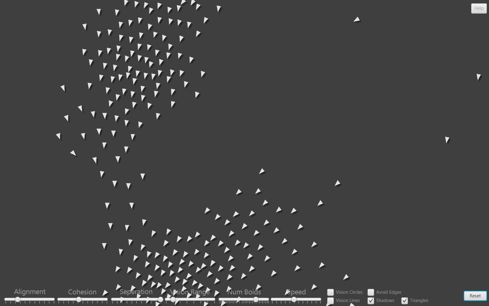

# Boid Simulation (FinalCS1)

This program is a basic simulation of the <a href="https://www.red3d.com/cwr/boids/">flocking algorithm</a> origonally laid out by Craig Reynolds in 1986. The idea is that a simple flocking simulation can be broken down into three rules that each individual agent follows:

### Alignment
Try to match the average velocity (speed and direction) of flockmates.
### Cohesion 
Try to move towards the center of the flock
### Seperation
Try to move away from flockmates that get too close. (dont crash)

The real flocking behavior comes out when you limit how far each agent(or boid) can see. With just these three simple rules you can really start to see how its suspected real flocks in nature work like birds and fish.

## Installation:
This program only requires two prerequisites:
- <a href="https://www.oracle.com/java/technologies/downloads/">JavaJDK</a>
- <a href="https://gluonhq.com/products/javafx/">Javafx</a>

Using this simulation can be a little complex to set up but once you do set it up it is easy. Once you have Javafx installed you need to navigate to the directory you installed it into, find the "lib" folder, and then copy the filepath. Pase it into the "--module-path="" " part of the commands in the start.txt file. Here is where the installation diverts for different systems: 

### Windows:
Rename "start.txt" to "start.bat".

### Mac: 
On mac you need to add one more line at the top of the file. Just add `cd ` with a space after it, then drag in the folder that this project is located. It should look something like `cd /Users/Username/Documents/finalcs1-7fi/`. Now remove the comment `:: Change module path for both commands` and then rename start.txt to start.command, and click yes to the prompt asking if you want to use the .command extention. Open a new terminal and type `chmod u+x `and make sure to include a space afterwards. Then drag the start.command file into the terminal window and hit enter.

Once you complete the relevent steps for your system, you should have completed the installation.

### Optionally for any system you can just use the respective command line tool to navigate into the installed folder, and run the commands from the start.txt file.

## Usage:
To use it, simply open the start file and a terminal window should pop up as well as the GUI itself.

There are many settings in the simulation that can be adjusted to create all sorts of different results. 

| Type     | Setting        | Usage                                                        |
| -------- | -------------- | ------------------------------------------------------------ |
| slider   | Alignment      | Adjusts the ["Alignment force"](#alignment)                  |
| slider   | Cohesion       | Adjusts the ["Cohesion force"](#cohesion)                    |
| slider   | Seperation     | Adjusts the ["Seperation force"](#seperation)                |
| slider   | Vision Range   | Adjusts how far each boid can "see"                          |
| slider   | Num Boids      | Adjusts the number of boids (5 - 300)                        |
| slider   | Speed          | Adjusts the speed of the boids                               |
| checkbox | Vision Circles | Adds a circle depicting the area each boid can "see"         |
| checkbox | Vision Lines   | Adds a line connecting boids that are in range of each-other |
| checkbox | Avoid Edges    | Makes boids steer away from edges                            |
| checkbox | Shadows        | Adds a shadow beneath each boid                              |
| checkbox | Triangles      | Toggles between triangle boids and circle boids              |

## Output: 
The output of this program is a simulated flock based on the input parameters. 

Sample: 

### Project by Carter Anderson (7fi)